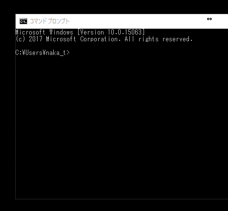

# Python練習帳
研究で私がよく使うPythonの機能をまとめました．一般的ではないやりかたや，より効率の良いやり方はあると思いますが，分かりやすさを優先してまとめました．

## インストール
サンプルはPython3を対象としています．
以下のサイトからanaconda 3.* (現時点ではanaconda3.7が最新)をインストールすると依存パッケージ等も含め，インストールされます．

https://www.anaconda.com/download/

一部のソースコードの実行にはOpenCVが必要です．anacondaインストール後に，以下のコマンドをコマンドプロンプト上で実行するとインストールされます．

    pip install opencv-python

コマンドプロンプト上で，以下のコマンドを実行するとSpyderと呼ばれる，統合環境が実行されます．

    spyder

左側のエディタにプログラムを書き，上にある三角のボタンを押すことで，プログラムが実行されます．
実行結果は右下のウィンドウに表示されます．

## 練習問題

以下のリンクのPC版のページに，よく使うPythonのサンプルコードが書いてあります．
(スマートフォンだと正しく表示出来ない場合があります．)

1. [Listの使い方](https://github.com/naka-tomo/practice_python/blob/master/1_list.ipynb)
2. [文字列処理](https://github.com/naka-tomo/practice_python/blob/master/2_string.ipynb)
3. [ファイルの入出力](https://github.com/naka-tomo/practice_python/blob/master/3_file.ipynb)
4. [numpyによる演算](https://github.com/naka-tomo/practice_python/blob/master/4_numpy.ipynb)
5. [グラフ表示](https://github.com/naka-tomo/practice_python/blob/master/5_graph.ipynb)
6. [opencvによる画像処理](https://github.com/naka-tomo/practice_python/blob/master/6_opencv.ipynb)
7. [上記以外のPythonの処理](https://github.com/naka-tomo/practice_python/blob/master/7_others.ipynb)
8. [pandasによる表操作](https://github.com/naka-tomo/practice_python/blob/master/8_pandas.ipynb)
9. [PythonによるGUIの作成](https://github.com/naka-tomo/practice_python/blob/master/9_GUI.ipynb)

各サンプルを参考にしてspyderで実際にプログラムを書き・実行しながら練習してみてください．
ただ単にコピペするだけではなく，一行一行何をしているのか考えながら**自身でプログラムを打ち込み**実行してください．
